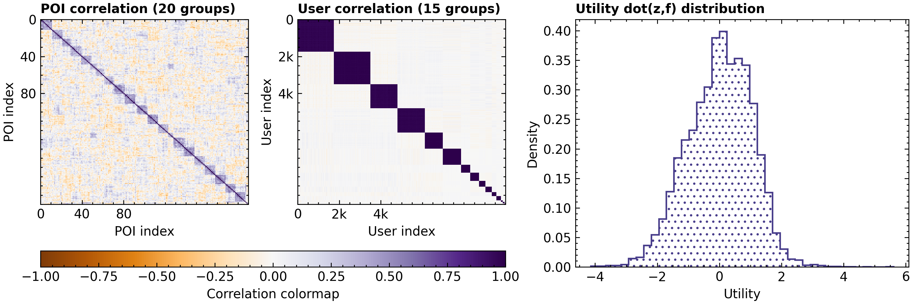

# tourist-profiles-data-generation

To get access to the original version --> branch [original](https://github.com/pashaPASHaa/tourist-profiles-data-generation/tree/original). Here I go further and introduce some improvements.

Repository contains source code to generate fine-grained tourist (user) profiles
by exploiting information about:
- Scarce polulation-aggregated tourist choices (summary tables, marginal sums).
- Points of interest (POIs, items) attributes.
- Rational (utility maximising) tourist behaviour when faced with a choice of POIs to visit.

**Tldr:**

- Demo dataset (reconstructed interactions of 10000 users with 200 items) => see `out` directory. <br>
- Corresponding reader => use `src/environment.py/load_condensed_artefacts` fn. <br>
- Corresponding generated log file => see `log` directory. <br>
- If you are interested to generate your own dataset, please read further this README file.

**Dataset schema:**

```text
# environment size
`N`      : i8                # number of generated users
`J`      : i8                # number of POIs in the universe

# behavioural data
`T_pmi`  : array[i8]         # index
`T_pmf`  : array[f8]         # distribution of users activity
`J_pmi`  : array[i8]         # index
`J_pmf`  : array[f8]         # distribution of items popularity
`G_pmi`  : array[i8]         # index
`G_pmf`  : array[f8]         # distribution of group sizes

# users and items
`z`      : array[f8,f8]      # [N,n_hid] learned user profiles
`f`      : array[f8,f8]      # [J,n_hid] learned (or apriori given) item profiles
```

**Configuration:**

```text
All parameters provided can be modified
to reflect a particular environment constraints. In environments,
where information about POIs is given, the researcher can skik POIs generation
step (see parameters `ncent`, `lam_min`, `lam_max`, `lam_obj`, `r`) with given POIs embeddings

| Parameter |                 Value | Parameter explanation                         |
|-----------|-----------------------|-----------------------------------------------|
| `n_hid`   |                    64 | dimension of hidden attributes                |
| `J`       |                   200 | number of items (POIs) in the universe        |
| `N`       |                 10000 | number of users (tourists) in a population    |
| `ncent`   |                    20 | number of clusters for items                  |
| `lam_min` |                   0.1 | min similarity multiplier within a cluster    |
| `lam_max` |                   0.5 | max similarity multiplier within a cluster    |
| `lam_obj` |                   0.7 | objective multiplier (trade-off LP+QP)        |
| `r`       |         U{-1;1}^n_hid | item attributes perturbation vector           |
| `beta`    |                     6 | inverse temperature                           |
| `lam_wg`  |                 0.001 | regularisation multiplier within a user group |
| `lam_bg`  |                 0.001 | regularisation multiplier between user groups |
| `G`       |                    15 | number of groups for users (typologies)       |
| `G_pmf`   |       see source code | users group volume marginal sum               |
| `T_pmf`   | (0.1,0.2,0.3,0.3,0.1) | users exploration activity marginal sum       |
| `J_pmf`   |          0.5*(1/rank) | items popularity marginal sum                 |
```

**Marginal sums and learned profiles:**

<p>

<br>
<em>
<strong>Marginal sums</strong>.
Left figure shows tourists activity distribution. 
In provided example, tourists visit from 1 to 5 POIs during their trip.
Right figure shows long-tail POIs popularity distribution.
The first POI attracts the attention of half the visitors, the
last is about 200 less popular than the first.
Any other valid distribution can be used in place of this demo example</em>
</p>

<br>

<p>

<br>
<em>
<strong>POI attributes and Tourist preferences profiles</strong>.
Left figure shows 20 clusters of POIs in the universe of 200 POIs.
POIs are reordered for better visual appearance: 
within each cluster POIs share common attributes while between clusters are almost uncorrelated.
Each POI has a sparse portrayal to reflect the fact that only a few attributes are present.
Tourist profiles (after learning) are shown in the middle figure.
There are 15 tourist groups for a synthetic population of 10000 tourists.
Within each group tourists behave look alike (share common preferences), 
while between groups tourists behave diversely in terms of preferences. 
Right figure showcases utility distribution in a synthetic population</em>
</p>

<br>

<p>

<br>
<em>
<strong>Optimised (learned) tourist choices</strong>.
Left figure shows simulated tourist choices based on utility-maximising behaviour assumption. 
Tourists within each of 15 groups tend to do similar choices, tourists between groups are more diverse in their choices.
Right figure shows marginal fit (total number of choices for each POI)</em>
</p>

**Usage:**

```text
1. configure parameters from the Table above to reflect the environment of your experiment
2. run `run_script.sh`
3. and wait (depending on your hardware and parameters configuration)
4. get file `experiment_condensed.hdf5` in `out` and `traininglog_condensed.log` in `log` directory
5. validate `experiment_condensed.hdf5` (user and item profiles) in `vis.ipynb`
6. use validated artefact `experiment_condensed.hdf5` in your research!
```

**Hardware used to run the experiment and prepare the artefact:**

```text
- server: Linux Ubuntu 22.04 + docker container with Ubuntu 22.04
- CPU: Intel(R) Xeon(R) CPU E5-2667 v3 @ 3.20GHz
- RAM: 96GB
- setup (N=10000, J=200, n_hid=64) requires 10GB RAM + 2GB HDD + 4h runtime
```

**Library requirements (content of `requirements.txt` file):**

```text
- cvxopt
- h5py
- jax[cpu]
- matplotlib
- numba
- numpy
- optax
- picos
- scikit-learn
```
